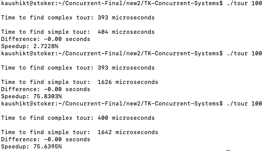
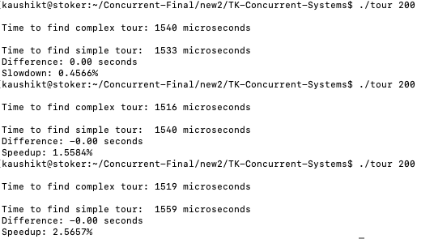
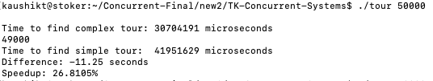
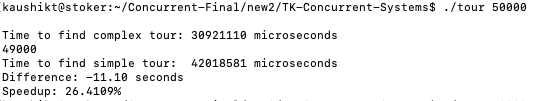
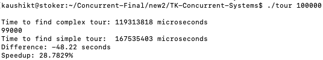
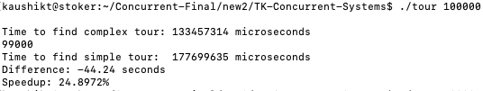

# TK-Concurrent-Systems
## Concurrent Systems Assignment

### Compile the Program - 
`gcc mytour.c sales.c -lm -fopenmp -o tour`

### Run the Program - 
`./tour 30000` (for 30,000 cities)
`./tour 50000` (for 50,000 cities)

## Changes and Remarks:
To see the changes and explaination in a better way, you can read the ReadMe.md file on `https://github.com/taaanmay/TK-Concurrent-Systems.git`
This repository will become public when the assignment deadline has been ellapsed. 

### Changes:
1) Added SIMD instructions and used OpenMP to parallelise and vectorise the code.
2) Firstly, Parallelised the for loop which initialises the visited array using Parallel For loop. Along with the parallelisation, we vectorised the code using SIMD    instructions.
3) Then, calculated the modified length called `modified_len` to accomodate the cases where ncities is not exactly divisibe by 4.
4) Created 2 arrays called city_X and city_Y which stores the x and y coordinates of every city. Used  Parallel For loop to parallelise this loop.
5) Then, to use SIMD vectorisation, Created __m128 variables to calculate the cost and distance. Using Parallel For Loop and SIMD variables, code was parallelised      and the distance was found much quicker.
6) Stored the cost in an array called `cost_array` which is used later in the code in comparing the costs.
7) In the end, we free up the space used by the cost_array.
8) We get guaranteed speedups when ncities > 35000. So, we run the sequential code when ncities is less than 30,000 and modified code is run otherwise. 
9) To measure the difference, speed-up and slowdown, we modified the sales.c file which prints the time taken by the modified code as well as time taken by the orignal code along with the difference percentage.
 
### Remarks:
1) Major difference is seen when there a large number of cities as parallelisation for a small dataset incorporates larger computational cost. 
2) Answers found through the sequential and parallel way are exactly same and accuracy is maintained.

## Proof of Speedup

### For No. of cities = 100

### For No. of cities = 200

### For No. of cities = 30,000

### For No. of cities = 50,000

### For No. of cities = 100,000

## Average Time for Unchanged code for different results
Unchanged Code

### Time for 10 - 
7
13
13
8
7
12
7
7
13
13

#### Average = 10 

### Time for 100 - 
190
186
186
399
394
434
394
397
394
399

#### Average = 337.3

### Time for 500 - 
9092
12603
9109
9126
9184
9117
9103
9115
9117
9119

#### Average = 9468.5

### Time for 1000-
35797
35834
35872
37093
36807
35715
36053
31805
36801
37144

#### Average = 35892.1

### Time for 2000-
142389
142212
143924
143133
67376
142386
143343
141902
141954
142750

#### Average = 135136.9

### Time for 20,000
7041881 microseconds
6647489 microseconds
7147596 microseconds
6980589 microseconds
7193061 microseconds

#### Average = 70,02,123

### Time for 30,000
15392809 microseconds
15381103 microseconds
15287771 microseconds
15180779 microseconds

#### Average = 1,53,10,616

### Time for 35,000
20730253 microseconds
20947452 microseconds
20626099 microseconds

#### Average = 2,07,67,935

