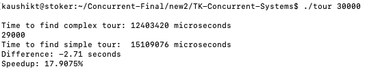

# TK-Concurrent-Systems
## Concurrent Systems Assignment

### Compile the Program - 
`gcc mytour.c sales.c -lm -fopenmp -o tour`

### Run the Program - 
`./tour 30000` (for 30,000 cities)
`./tour 50000` (for 50,000 cities)

## Proof of Speedup
### For No. of cities = 30,000

## Average Time for Unchanged code for different results
Unchanged Code

### Time for 10 - 
7
13
13
8
7
12
7
7
13
13

#### Average = 10 

### Time for 100 - 
190
186
186
399
394
434
394
397
394
399

#### Average = 337.3

### Time for 500 - 
9092
12603
9109
9126
9184
9117
9103
9115
9117
9119

#### Average = 9468.5

### Time for 1000-
35797
35834
35872
37093
36807
35715
36053
31805
36801
37144

#### Average = 35892.1

### Time for 2000-
142389
142212
143924
143133
67376
142386
143343
141902
141954
142750

#### Average = 135136.9

### Time for 20,000
7041881 microseconds
6647489 microseconds
7147596 microseconds
6980589 microseconds
7193061 microseconds

#### Average = 70,02,123

### Time for 30,000
15392809 microseconds
15381103 microseconds
15287771 microseconds
15180779 microseconds

#### Average = 1,53,10,616

### Time for 35,000
20730253 microseconds
20947452 microseconds
20626099 microseconds

#### Average = 2,07,67,935

